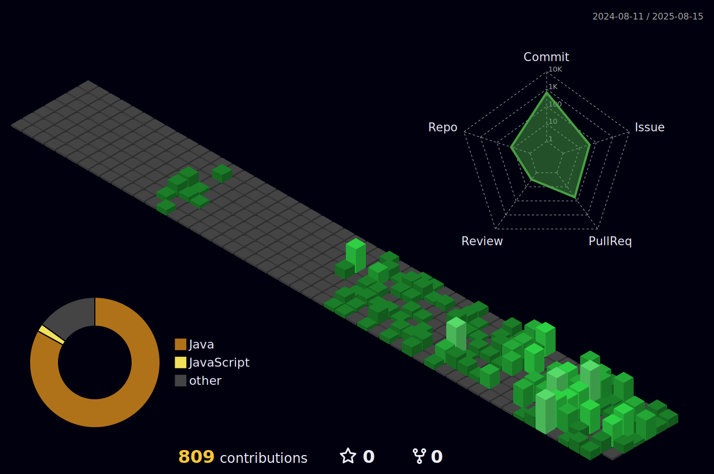

``` java
System.out.println("Hello!");
```

## Career
- 2024.09 ~ 2025.02: **Hult Prize On Campus** 창업 경진 대회 (운영 부팀장)
- 2025.03 ~ 🚀: 안양대학교 자율전공 학생 대상 **Student Advisor** 활동
- 2025.03 ~ ☁️: [kakao x goorm] **구름톤 유니브 4기** 안양대학교 미르미 활동

## Project
- 2025.04 ~ 2025.06: 국토교통 데이터 경진대회(Jeonse-ive) 서버 파트 [🔗](https://github.com/Jeonse-ive)
- 2025.07 ~ 2025.07: [kakao x goorm] 구름톤 유니브 4기 경인X경기북부 연합 해커톤 9ITHON 서버 파트  [🔗](https://github.com/9ITHON/7-ToGetHer-BE)

## Stack
[](https://skillicons.dev)
[](https://skillicons.dev)

## SNS
###  Tech Blog [🔗](https://mydcaf.tistory.com/)  
###  Instagram [🔗](https://www.instagram.com/good_junseon/)

---
<table>
  <tr>
    <td>
      <a href="https://www.gitanimals.org/en_US?utm_medium=image&utm_source=goodjunseon&utm_content=farm">
        
      </a>
    </td>
    <td>
      
    </td>
  </tr>
</table>

<!--
[](https://solved.ac/pzs20019)
-->

