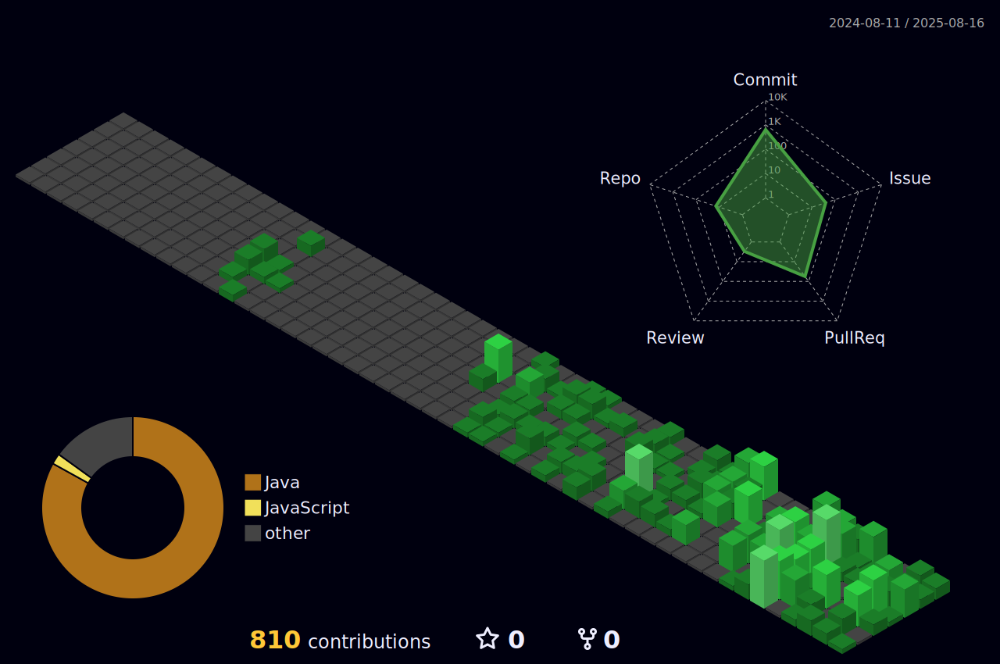

``` java
System.out.println("Hello!");
```

### 🎓 Experience & Social Activity

| 소속 및 활동                            | 활동 기간              | 내용 |
|----------------------------------------|------------------------|------|
| 안양대학교                 | 2021.03 ~ 현재         | 안양대학교 컴퓨터공학부 재학 중 |
| [Hult Prize](https://www.hultprize.org/how-it-works/) On Campus 운영진           | 2024.09 ~ 2025.02     | 창업 경진 대회 교내 운영 및 기획 |
| 안양대학교 Student Advisor             | 2025.03 ~ 현재         | 신입생 자율전공학생 멘토링 활동  |
| 안양대학교 IC LAB                      | 2025.03 ~ 현재         | 
| [kakao x goorm] [구름톤](https://9oormthon.university/) Univ 4기       | 2025.03 ~ 2025.09         | **[`'9ITHON'`](https://github.com/9ITHON)** [`교내 운영진`](https://github.com/goodjunseon/goodjunseon/blob/main/images/%E1%84%80%E1%85%AE%E1%84%85%E1%85%B3%E1%86%B7%E1%84%90%E1%85%A9%E1%86%AB%20%E1%84%8B%E1%85%B2%E1%84%82%E1%85%B5%E1%84%87%E1%85%B34%E1%84%80%E1%85%B5%20%E1%84%89%E1%85%AE%E1%84%85%E1%85%AD%E1%84%8C%E1%85%B3%E1%86%BC.png)  |
| 대학생 IT 연합 동아리 [Tave](https://www.tave-wave.com/) 16기                | 2025.09 ~ 현재         |  |

### 💻 Projects

| 기간 | 내용 |
|------|------|
| 2025.04 ~ 2024.05 | 국가 교통정보 공공 데이터 활용 공모전 **[`'Jeonse-ive'`](https://github.com/Jeonse-ive)** Backend|
| 2025.07 ~ 2025.07 | 우리의 피임, 함께라서 더 안전하고 편안하게 **[`'ToGetHer'`](https://github.com/goodjunseon/7-ToGetHer-BE)** **`Lead`** Backend, CI/CD 개발 |
| 2025.08 ~ 현재 | 안양대학교 축제 올인원 서비스 **[`'Passtival'`](https://github.com/Passtival/Passtival-server)** **`Lead`** Backend, CI/CD 개발 |


## Stack
[](https://skillicons.dev)
[](https://skillicons.dev)

## SNS
###  Blog [🔗](https://mydcaf.tistory.com/)  
###  Instagram [🔗](https://www.instagram.com/good_junseon/)

---
<table>
  <tr>
    <td>
      <a href="https://www.gitanimals.org/en_US?utm_medium=image&utm_source=goodjunseon&utm_content=farm">
        
      </a>
    </td>
    <td>
      
    </td>
  </tr>
</table>

<!--
[](https://solved.ac/pzs20019)
-->

